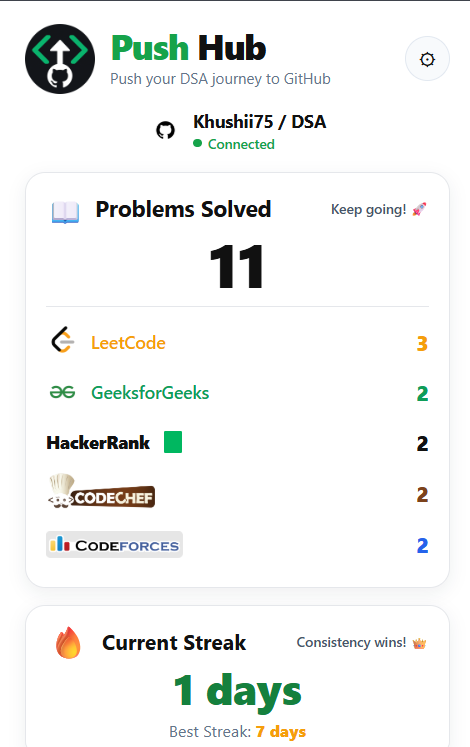
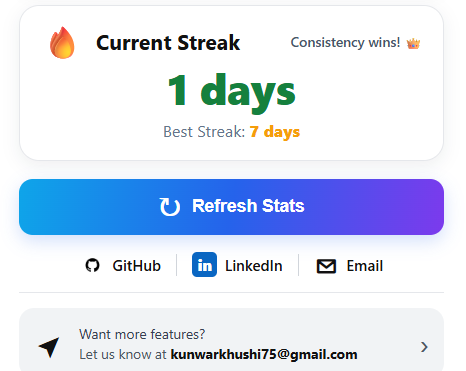

# 🚀 PushHub

<p align="center">
  
</p>

<h3 align="center">Push your DSA journey to GitHub.</h3>

<p align="center">
  An all-in-one Chrome extension that automatically syncs your accepted competitive programming solutions to GitHub and keeps your DSA repository meticulously organized.
</p>

<p align="center">
  
  
  
  
  
  
</p>

---

## 📌 Overview

**PushHub** is a Chrome extension built to eliminate friction for developers preparing for coding interviews and competitive programming.

It connects major coding platforms directly with GitHub and automates the repetitive, manual chores of maintaining a Data Structures and Algorithms repository.

Instead of manually:
- Copying accepted code across tabs
- Creating topic directories
- Naming files and matching extensions
- Pasting problem links and problem statements
- Organizing problems by category
- Writing solution documentation
- Tracking streaks across fragmented platforms

**PushHub handles it all behind the scenes.**

### The Workflow:
```text
Solve Problem  ──►  Get Accepted  ──►  Sync with One Click  ──►  Structured GitHub Repo
🎯 Why PushHub?
Competitive programmers often solve problems across LeetCode, GeeksforGeeks, CodeChef, Codeforces, and HackerRank. However, keeping a clean, showcase-ready GitHub repository usually turns into a chore that interrupts your problem-solving flow.

PushHub bridges that gap.

The Manual Grind vs. PushHub
Without PushHub                         With PushHub
───────────────                         ────────────
Solve Problem                           Solve Problem
      ↓                                       ↓
Submit                                  Submit
      ↓                                       ↓
Copy Code                               Accepted ✅
      ↓                                       ↓
Open GitHub                             Sync to GitHub 🚀
      ↓                                       ↓
Find Repository                         Done (Clean & Organized!)
      ↓
Create Folder
      ↓
Create File
      ↓
Rename File
      ↓
Add Problem Link
      ↓
Repeat hundreds of times...

The goal is simple: Spend more time mastering algorithms, and zero time managing files.


### 🌐 Supported Platforms

| Platform | Accepted Detection | Automated GitHub Sync |
| :--- | :---: | :---: |
| 🟠 **LeetCode** | ✅ | ✅ |
| 🟢 **GeeksforGeeks** | ✅ | ✅ |
| 🟩 **HackerRank** | ✅ | ✅ |
| 🟤 **CodeChef** | ✅ | ✅ |
| 🌈 **Codeforces** | ✅ | ✅ |

### ⚡ Core Features

🔄 One-Click GitHub Synchronization
After submitting and receiving an accepted verdict, PushHub triggers a seamless sync action to push the clean solution directly into your designated repository.

Accepted Submission ──► "Sync to GitHub" ──► GitHub Repository

🤖 Automatic Solution Extraction
PushHub intercepts and extracts metadata accurately from the page DOM and network events:

> Problem title and problem ID
> Target programming language
> Final submitted source code
> Source platform tag
> Direct problem URL
> Topic tags and categories

🗂️ Automatic Topic-Based Organization

Instead of dumping every single file into the root folder, PushHub arranges problems into dedicated DSA topic categories.

🧠 Topic Classification Categories

Whenever platform tags are available, PushHub maps the problem into one of the following curated DSA categories:
Data Structures: Array, String, Linked List, Stack, Queue, Tree, Binary Tree, Binary Search Tree, Heap, Matrix
Algorithms & Techniques: Dynamic Programming, Greedy, Recursion, Backtracking, Hashing, Sorting, Searching, Bit Manipulation, Mathematics, Sliding Window, Two Pointer, Prefix Sum
Fallback: Other/ (ensures zero misplaced solutions when category tags are ambiguous)

📄 Standardized Problem Layout
Every synced problem receives its own dedicated directory with clean file naming and auto-generated documentation:

Topic/
└── ProblemIdentifier-ProblemName/
    ├── ProblemIdentifier-ProblemName.ext-(platform)
    └── README.md

📊 DSA Progress Dashboard & Streak Tracking
PushHub includes an integrated overview dashboard built right into the extension popup.

Metrics Tracked:
Total Problems Solved
Platform Breakdown: LeetCode, GeeksforGeeks, HackerRank, CodeChef, Codeforces
Current Solving Streak: Consecutive days actively solving problems
Best Solving Streak: Longest recorded active solving streak

## 📊 PushHub Dashboard

<p align="center">
  
  &nbsp;&nbsp;&nbsp;&nbsp;
  
</p>
Don't just solve more. Solve consistently.

🔗 GitHub Integration & Security
PushHub connects directly via GitHub OAuth, following secure authorization best practices.

Authorization Workflow:
┌───────────────┐
│    PushHub    │
└───────┬───────┘
        │
        ▼
┌───────────────┐
│ GitHub OAuth  │
└───────┬───────┘
        │
        ▼
┌───────────────┐
│ User Confirms │
└───────┬───────┘
        │
        ▼
┌───────────────┐
│ Select / Link │
│ DSA Repository│
└───────┬───────┘
        │
        ▼
┌───────────────┐
│ Sync Solution │
└───────────────┘

Architecture Separation:
PushHub keeps the extension engine distinct from your personal DSA portfolio:

PushHub Project Repository: Contains the Chrome extension code, Node.js backend, bridge scripts, and extension assets.

Your Personal DSA Repository: The destination repository where your solutions, markdown notes, and topic directories live.

🧩 How PushHub Works
┌─────────────────────────────────────────────────────────┐
│               Coding & Contest Platforms                │
│    LeetCode  │  GeeksforGeeks  │  HackerRank  │  CC  │  CF │
└────────────────────────────┬────────────────────────────┘
                             │
                             ▼
                  ┌─────────────────────┐
                  │ Accepted Detection  │
                  └──────────┬──────────┘
                             │
                             ▼
                  ┌─────────────────────┐
                  │ Solution Extraction │
                  └──────────┬──────────┘
                             │
                             ▼
                  ┌─────────────────────┐
                  │ Problem Metadata &  │
                  │   Classification    │
                  └──────────┬──────────┘
                             │
                             ▼
                  ┌─────────────────────┐
                  │   PushHub Backend   │
                  │    & GitHub API     │
                  └──────────┬──────────┘
                             │
                             ▼
                  ┌─────────────────────┐
                  │   Organized GitHub  │
                  │    DSA Repository   │
                  └─────────────────────┘

🏗️ Project Architecture

PushHub/
│
├── assets/
│   ├── codechef.png
│   ├── codeforces.png
│   ├── gfg.png
│   ├── github.png
│   ├── hackerrank.png
│   ├── leetcode.png
│   └── pushhub-logo.png
│
├── github/
│   └── auth.js
│
├── platforms/
│   ├── leetcode.js
│   ├── gfg.js
│   ├── gfg-bridge.js
│   ├── hackerrank.js
│   ├── hackerrank-bridge.js
│   ├── codechef.js
│   ├── codechef-bridge.js
│   ├── codeforces.js
│   └── codeforces-bridge.js
│
├── popup/
│   ├── popup.html
│   ├── popup.css
│   └── popup.js
│
├── screenshots/
│   ├── dashboard-top.png
│   ├── dashboard-bottom.png
│   ├── sync-button.png
│   ├── sync-success.png
│   └── github-organization.png
│
├── server/
│   ├── server.js
│   ├── package.json
│   ├── package-lock.json
│   └── .env
│
├── background.js
├── manifest.json
└── README.md

🛠️ Technology Stack
Extension Framework: Chrome Extension API (Manifest V3)

Frontend / Popup: JavaScript (ES6+), HTML5, CSS3

Backend: Node.js, Express.js

Authentication: GitHub OAuth 2.0

APIs & Storage: GitHub REST API, Chrome Storage API

Scraping & Injection: Content Scripts, DOM Mutation Observers, Platform Bridge Injectors

🚀 Installation & Setup

Prerequisites
Node.js (v16 or higher)

Google Chrome or any Chromium-based browser

A registered GitHub OAuth Application

1. Clone the Repository

git clone https://github.com/Khushii75/PushHub.git
cd PushHub

2. Set Up the OAuth Backend

cd server
npm install

Create a .env file inside the server/ directory:
PORT=5000
GITHUB_CLIENT_ID=your_github_client_id
GITHUB_CLIENT_SECRET=your_github_client_secret

Start the server:
npm start

3. Load the Extension into Chrome

Open Chrome and navigate to chrome://extensions/.
Toggle on Developer mode in the top right corner.
Click Load unpacked in the top left corner.
Select the root PushHub folder.
Pin PushHub to your browser toolbar.
Click the extension icon, connect your GitHub account, and select your destination DSA repository.

### 📸 Screenshots & Showcase

<p align="center">
  
</p>

### 🔒 Privacy & Security

No Passwords Stored: PushHub utilizes official GitHub OAuth workflows; your raw GitHub password is never requested or stored.

Environment Isolation: The OAuth client secret remains securely on the backend server and is never committed to version control.

Minimal Scopes: Requests only the permissions necessary to manage files in your authorized repository.

🔮 Future Roadmap

[ ] Chrome Web Store official publication
[ ] Support for Codeforces Gym and AtCoder
[ ] Custom user directory mapping (configure folder names per topic)
[ ] Multi-language solution versioning (grouping Python, C++, and Java under one problem folder)
[ ] In-depth analytics: problem difficulty distributions (Easy, Medium, Hard)
[ ] Automated daily streak reminders and browser notifications

🤝 Contributing

Contributions are always welcome! If you have suggestions or improvements:

Fork the Project
Create your Feature Branch (git checkout -b feature/AmazingFeature)
Commit your Changes (git commit -m 'Add some AmazingFeature')
Push to the Branch (git push origin feature/AmazingFeature)
Open a Pull Request

👩‍💻 Author
Khushi Kunwar
kunwarkhushi75@gmail.com

Building tools to make DSA practice, algorithmic mastery, and GitHub tracking effortless.


